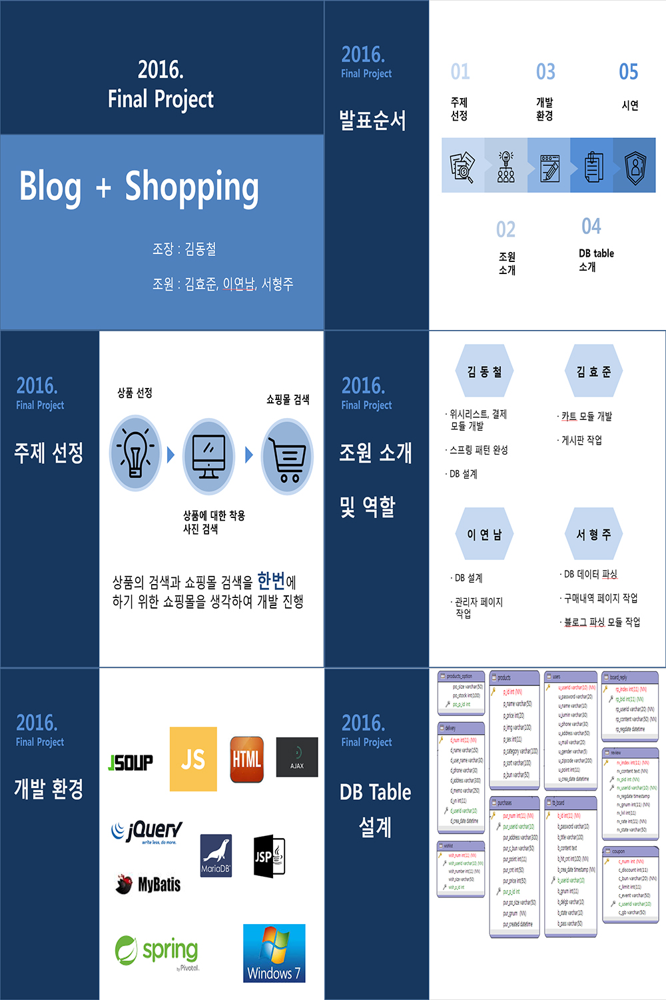
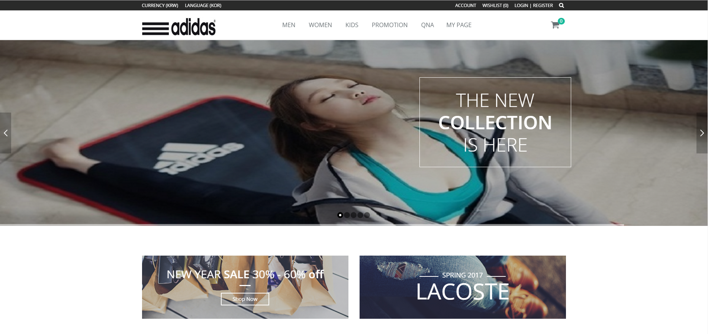
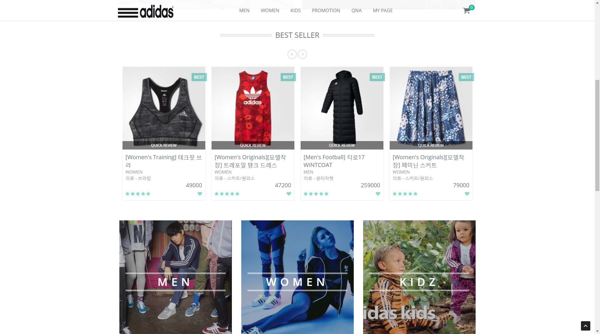
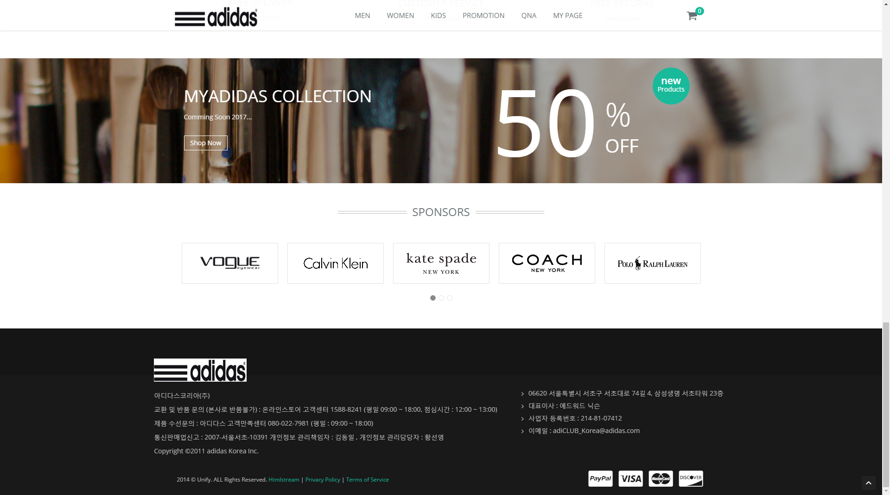

# Spring 팀 프로젝트  
\##2016년 10월
프레임워크 기반의 응용 SW 개발자 수업 이수 과정 중에 팀 프로젝트 진행! 

처음 경험하는 Spring기반 팀 프로젝트여서 완성에 포커스를 뒀고 
과분하지만 팀장을 맡아서 진행하였다. 

그 당시 프리젠테이션때 사용한 ppt 일부
 

여담이지만 원래 이 프로젝트는 네이버에서 2015년에 출시한 폴라(pholar)라는 소셜 네트워크 서비스(SNS)에서 영감을 얻었다.  
폴라는 사진 및 동영상 공유같은 Instagram과 같은 유사한 서비스를 제공해주는데 이 서비스를 조금 제한해서 상품명 검색으로 상품사진들을 공유하고 리뷰할수있으면
어떨까라는 생각이 들었다. 그것도 쇼핑몰의 일부 기능으로써.. 그렇게되면 실제 착용사진도 쉽게 확인가능하고 서비스가 쇼핑몰 내부에서 돌게되니 고객 유치에도 
용이하겠구나 생각했다.   
그래서 기반이 되는 쇼핑몰 먼저 구축을 하였다. 
## <strong>메인화면</strong>  
### \#header, gnb, visual 부분
 
### \#contents 부분 
 
### \#footer 부분 

### \#상품분류 페이지 
<img src=''
