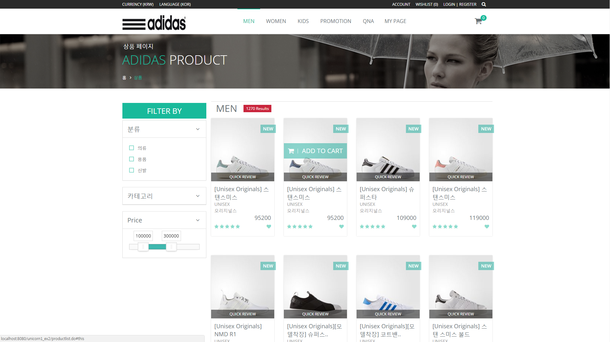
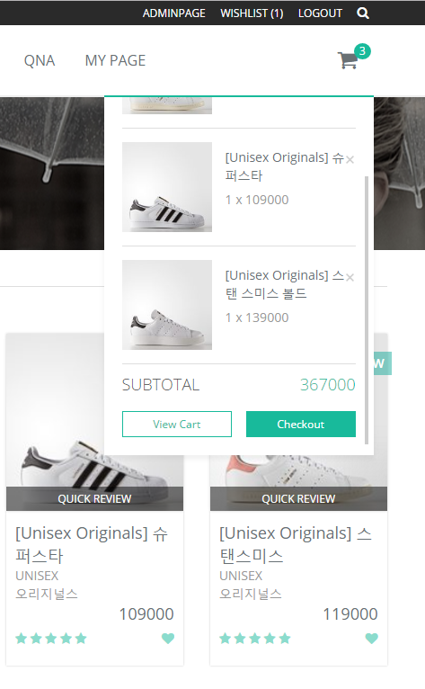

# Spring 팀 프로젝트  
\##2016년 10월
프레임워크 기반의 응용 SW 개발자 수업 이수 과정 중에 팀 프로젝트 진행! 

처음 경험하는 Spring기반 팀 프로젝트여서 완성에 포커스를 뒀고 
과분하지만 팀장을 맡아서 진행하였다. 

그 당시 프리젠테이션때 사용한 ppt 일부
 

여담이지만 원래 이 프로젝트는 네이버에서 2015년에 출시한 폴라(pholar)라는 소셜 네트워크 서비스(SNS)에서 영감을 얻었다.  
폴라는 사진 및 동영상 공유같은 Instagram과 같은 유사한 서비스를 제공해주는데 이 서비스를 조금 제한해서 상품명 검색으로 상품사진들을 공유하고 리뷰할수있으면
어떨까라는 생각이 들었다. 그것도 쇼핑몰의 일부 기능으로써.. 그렇게되면 실제 착용사진도 쉽게 확인가능하고 서비스가 쇼핑몰 내부에서 돌게되니 고객 유치에도 
용이하겠구나 생각했다.   
그래서 기반이 되는 쇼핑몰 먼저 구축을 하였다. 
## <strong>메인화면</strong>  
### \#header, gnb, visual 부분
 
### \#contents 부분 
 
### \#footer 부분 

## <strong>상품 화면</strong> 
### \#상품분류 화면

\#이부분은 크게 썸네일, 필터가 있는데 필터를 누를때마다 쿼리를 날려 해당 분류에 맞는 제품을 보여주고 
  &nbsp;썸네일 부분은 이미지를 누르면 상세보기, 마우스를 over하면 이미지 중간부분에 카트에 add할수있는 버튼기능을 붙였다.  
  기능구현에 들어간 기술은 HTML, javascript, jQUERY, Bootstrap이다. 

### \#카트 화면
 
\#썸네일에서 상품을 카트에 담는 기능은 세션처리를 했다.  
카트가 비어있으면 hashmap에 차곡차곡 담고 이미 카트에있던 상품을 중복으로 담을시엔 
세션 확인 후 이미 생성된 값이면 수량만 + 해주는 식으로 만들었다 !  
Ajax로 해당 카트 클래스 호출하여 처리하고 해당페이지 reload 하는식으로 했더니 잘 구현됐다.  
지우는 것 역시 마찬가지로 jQUERY로 해당 index 추적하여 세션삭제해주고 페이지 reload해주었다.  
subtotal 가격변동은 jQUERY로 해당 index에 price,quantity 값 조회하여 +- 따른 변동값 출력하게끔 설계했다.  
페이지가 reload되면서 헤더쪽에 카트에 +- 상품의 수만큼 숫자 refresh 등 하다보니 생각보다 신경쓸게 많았다..

