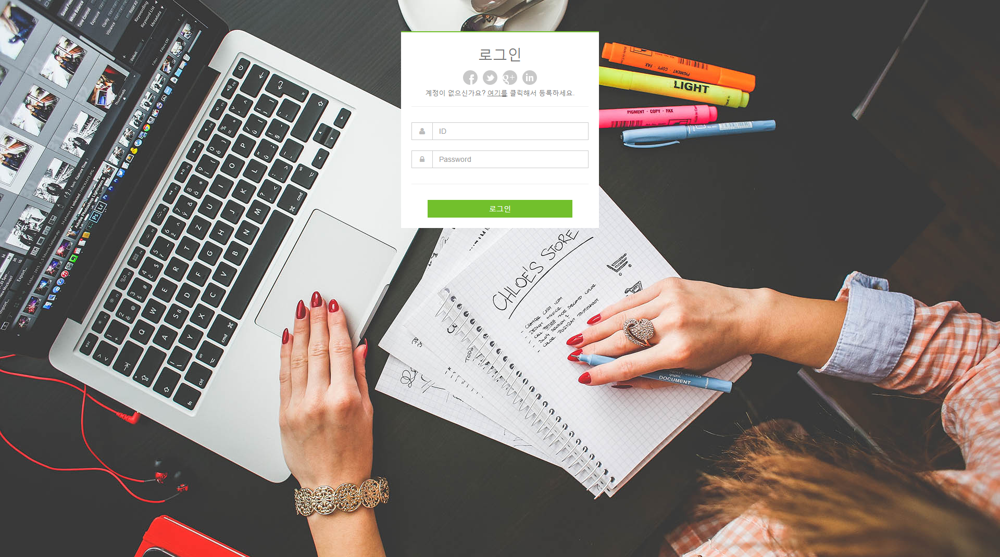
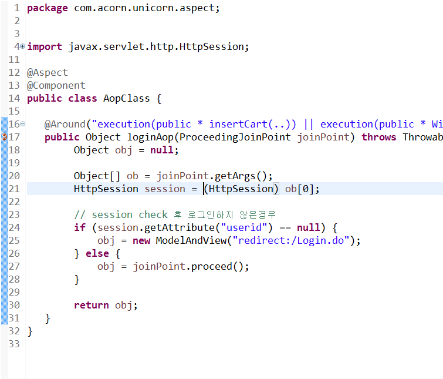
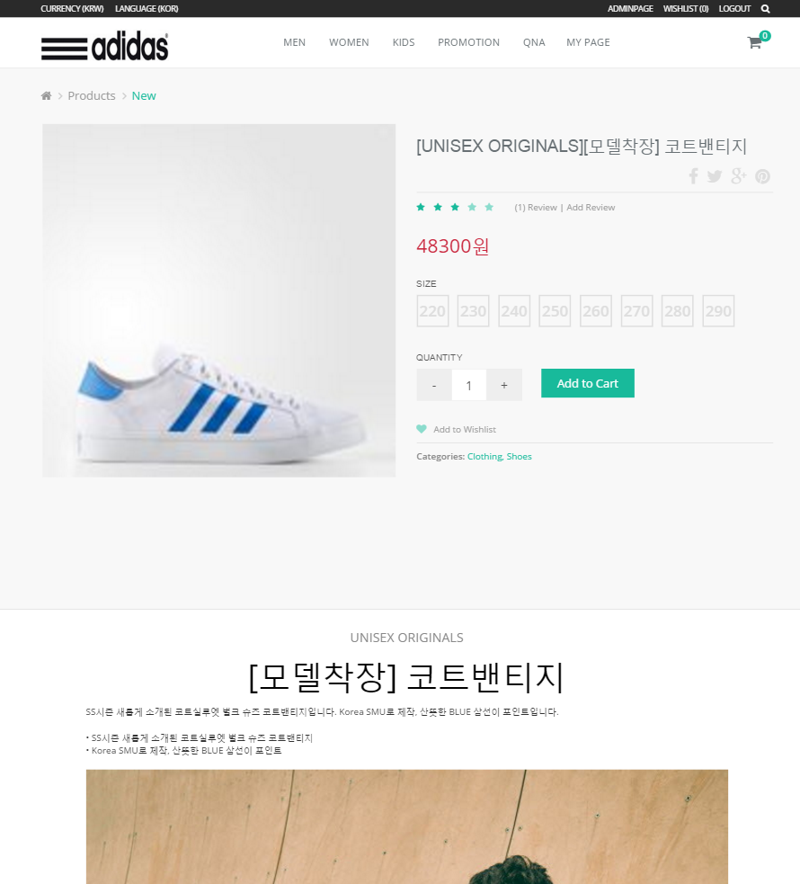
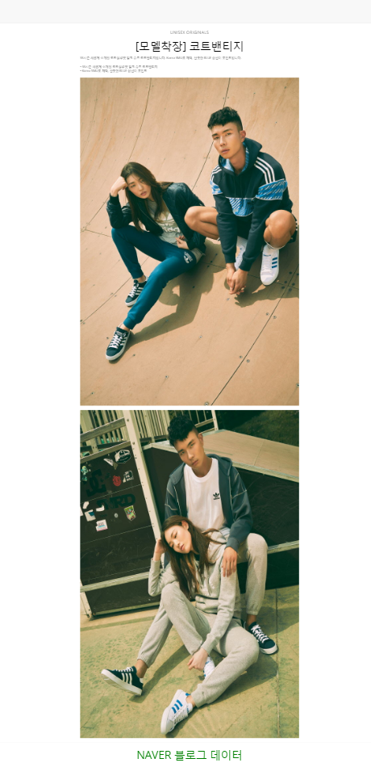
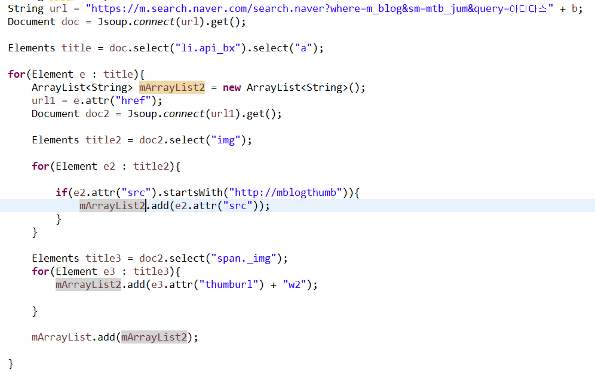
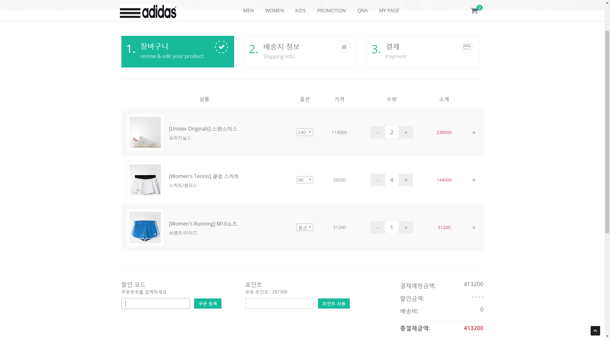
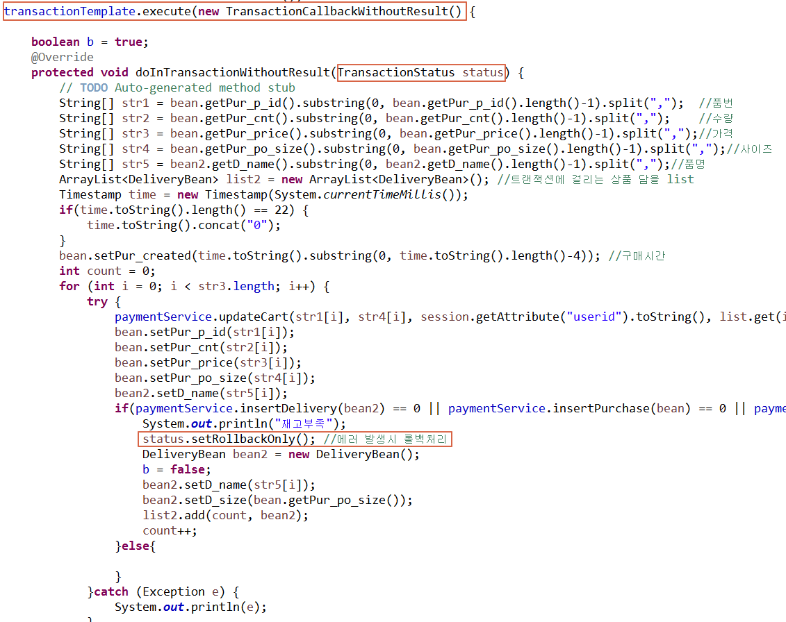
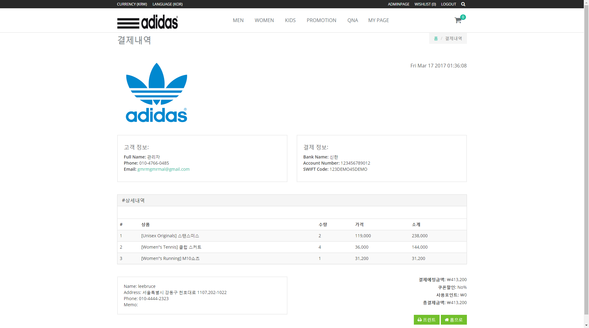

# Spring 팀 프로젝트  
\##2016년 10월
프레임워크 기반의 응용 SW 개발자 수업 이수 과정 중에 팀 프로젝트 진행! 

처음 경험하는 Spring기반 팀 프로젝트여서 완성에 포커스를 뒀고 
과분하지만 팀장을 맡아서 진행하였습니다...  
제작기간은 기획 3일, 코딩 2주, 테스트 및 코드 수정 1주해서 총 24일이 걸렸다.

그 당시 프리젠테이션때 사용한 ppt 일부
 

여담이지만 원래 이 프로젝트는 네이버에서 2015년에 출시한 폴라(pholar)라는 소셜 네트워크 서비스(SNS)에서 영감을 얻었다.  
폴라는 사진 및 동영상 공유같은 Instagram과 같은 유사한 서비스를 제공해주는데 이 서비스를 조금 제한해서 상품명 검색으로 상품사진들을 공유하고 리뷰할수있으면
어떨까라는 생각이 들었다. 그것도 쇼핑몰의 일부 기능으로써.. 그렇게되면 실제 착용사진도 쉽게 확인가능하고 서비스가 쇼핑몰 내부에서 돌게되니 고객 유치에도 
용이하겠구나 생각했다.   
그래서 기반이 되는 쇼핑몰 먼저 구축을 하였다. 
## <strong>메인화면</strong>  
### \#header, gnb, visual 부분
 
### \#contents 부분 
 
### \#footer 부분 

## <strong>로그인 화면</strong>
### \#로그인

\#상품 뷰는 가능하지만 모든 서비스는 로그인을 해야되도록 설계했다. 결국 모든 서비스에 로그인이 필요하지만 
Spring의 3대 기능 중 하나인 AOP를 써보고싶어서 접목시켜보기로 했다.  

\#이렇게 해당 페이지의 클래스에 접근하려고하면 로그인 session이 존재하면 joinPoint를 Object에 담아서 리턴하고  
session이 존재하지않으면 로그인페이지를 담은 Object를 리턴한다.

## <strong>상품 화면</strong> 
### \#상품분류 화면

\#이부분은 크게 썸네일, 필터가 있는데 필터를 누를때마다 쿼리를 날려 해당 분류에 맞는 제품을 보여주고 
  &nbsp;썸네일 부분은 이미지를 누르면 상세보기, 마우스를 over하면 이미지 중간부분에 카트에 add할수있는 버튼기능을 붙였다.  
  기능구현에 들어간 기술은 HTML, javascript, jQUERY, Bootstrap이다. 

### \#카트 화면
 
\#썸네일에서 상품을 카트에 담는 기능은 세션처리를 했다.  
카트가 비어있으면 hashmap에 차곡차곡 담고 이미 카트에있던 상품을 중복으로 담을시엔 
세션 확인 후 이미 생성된 값이면 수량만 + 해주는 식으로 만들었다 !  
Ajax로 해당 카트 클래스 호출하여 처리하고 해당페이지 reload 하는식으로 했더니 잘 구현됐다.  
지우는 것 역시 마찬가지로 jQUERY로 해당 index 추적하여 세션삭제해주고 페이지 reload해주었다.  
subtotal 가격변동은 jQUERY로 해당 index에 price,quantity 값 조회하여 +- 따른 변동값 출력하게끔 설계했다.  
페이지가 reload되면서 헤더쪽에 카트에 +- 상품의 수만큼 숫자 refresh 등 하다보니 생각보다 신경쓸게 많았다..

### \#상품조회 화면
 
\#상품을 누르면 상품을 조회할 수 있는데 여기서 파싱을 한번 해보기로했다.  
 
\#이 착용샷들은 DB에 저장된 데이터를 불러온게 아니고 네이버블로그에서 파싱을 해온 것들을 뿌려주고있는 것이다... 
이 기능을 구현하기위해 JAVA 라이브러리인 Jsoup을 사용했다.
 
\#위와 같이 타겟 url을 정해주고 Jsoup으로 이미지 데이터만 추출하여 파싱했다. 검색 결과값은 네이버블로그를 겨냥했는데 
네이버는 iframe사용으로 의도적으로 파싱을 막아놓은건지.. 모르겠지만 오기가 생겼던걸까 여러방법을 모색하다보니  
네이버 모바일은 막혀있지않아서 모바일 url의 힘을 빌리기로했다...이러라고 만든 파싱이 아닌건알지만 써보고싶었다..

## <strong>위시리스트 & 결제</strong>
### \#위시리스트
 
\#위시리스트 이 부분도 꽤나 신경썼던거같다. 카트 혹은 썸네일에서 위시리스트로 보낼 수 있게 설계했는데 어디에서 오든  
수량 에러없이 update해주고 수량 +-, 할인금액에 따른 소계, 총결제금액 변동값 반영해주는걸 jQUERY로 열심히 짜봤다. 
이 페이지에서 곧바로 결제화면까지 이어지는데 여기서 가장 큰 이슈 여러가지 에러에대한 롤백이였다.  
위시리스트에 담을때는 재고 유무를 파악해서 품절된 상품에 대한 대처가 가능한데 담고 결제완료~까지  
이 상품이 품절인지 아닌지 알수없고.. 쿠폰과 포인트는 사용했는데 상품 품절이 됐다던가..  
이러한 이유에서 Spring에서 제공하는 Transaction 기능을 사용했다.  
  
위와 같이 생성자 호출하면 오버라이드 된 클래스에 인자로 TransactionStatus클래스가 들어가는데  
이 인자값으로 트랜잭션 상태 표현이 가능하다. 결제에 있어서 위에 어떤 이유에서든지 DB CRUD 과정중에서 에러가나면  
status.setRollbackOnly() 표현으로 인해 일괄 롤백처리가 된다. 

 
결제가 무사히 완료되면 이렇게 결제내역 창을 띄워준다. 

## <strong>프로젝트를 마치고..</strong>

팀 프로젝트를 하다보니 처음 기획했던것과는 상이한 결과물이 나와서 조금 놀랐다..사실 많이 놀랐다.  
팀장으로서 의도한 바를 제대로 어필을 못했거나 팀원으로서 프로젝트 이해를 잘 못했거나.. 아님 둘다이거나! 
어떤 이유든 본인이 한참 부족하다는 느낌을 받았다..  
혼자 날고 긴다고 되는일이 아니기에 어떠한 상황에서든 소통만큼 중요한건 없다고 생각한다ㅎ  
이번계기로 좋은사람들과 함께 개발을 한다는게 어떤 시너지를 주는지 알게 됐다. 개발 기간중에 웃음이 끊이질 않았다ㅠㅠ 
배운게 참 많은 프로젝트였던 것 같다.  
